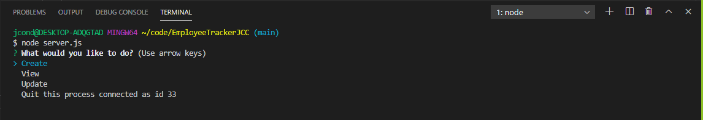
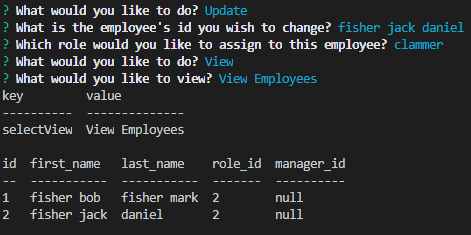

# EmployeeTrackerJCC

## Table Of Contents

* [Description](#description)
* [Installation](#installation)
* [Usage](#usage)
* [Questions](#questions)

## Description

This is a fully functioning application developed to assist a company or manager in storing Department, Role, and Employee data. The user is able to create, view, and update all of their data as needed to manage employee and business information.

    Main Start-Up Terminal

    Viewing Departments

    Updating Employee Role

## Installation

When using this application, initially you must run "npm install" to download any node package dependecies for your package.json. You must also copy the schema.sql file into your mysql workbench and run it to produce the tables needed for storing the information.

## Usage

Initialize the application by opening a terminal in the server.js and running "node server.js". This will prompt the questions Create, View, and Update. Create will take you to creating dapartments, roles, and employees. View will allow you to view created departments, roles, and employees. Update will ask for an existing employees info and the info you wish to replace it with, and make changes in the database acoordingly.

## Questions

If you have any questions or concerns regarding this application an its development, please feel free to reach out to me at jcondonpro@gmail.com.